<a id="readme-top"></a>

<!-- PROJECT LOGO & TITLE -->

<div align="center">
  <a href="https://github.com/opencloudhub">
  <picture>
    <source media="(prefers-color-scheme: light)" srcset="https://raw.githubusercontent.com/opencloudhub/.github/main/assets/brand/assets/logos/primary-logo-light.svg">
    <source media="(prefers-color-scheme: dark)" srcset="https://raw.githubusercontent.com/opencloudhub/.github/main/assets/brand/assets/logos/primary-logo-dark.svg">
    <!-- Fallback -->
    
  </picture>
  </a>

<h1 align="center">Qwen2.5-VL Radiology — Vision-Language Fine-Tuning Demo</h1>

<p align="center">
    Multimodal MLOps with Vision-Language Model fine-tuning, demonstrating QLoRA, custom MLflow integration, prompt versioning, and fractional GPU allocation.<br />
    <a href="https://github.com/opencloudhub"><strong>Explore OpenCloudHub »</strong></a>
  </p>
</div>

______________________________________________________________________

<details>
  <summary>📑 Table of Contents</summary>
  <ol>
    <li><a href="#about">About</a></li>
    <li><a href="#thesis-context">Thesis Context</a></li>
    <li><a href="#architecture">Architecture</a></li>
    <li><a href="#code-structure">Code Structure</a></li>
    <li><a href="#getting-started">Getting Started</a></li>
    <li><a href="#infrastructure">Infrastructure Options</a></li>
    <li><a href="#usage">Usage</a></li>
    <li><a href="#configuration">Configuration</a></li>
    <li><a href="#workflow-tags">Workflow Tags & Traceability</a></li>
    <li><a href="#contributing">Contributing</a></li>
    <li><a href="#license">License</a></li>
  </ol>
</details>

______________________________________________________________________

<h2 id="about">🎯 About</h2>

This repository demonstrates **Vision-Language Model (VLM) fine-tuning** using Qwen2.5-VL for radiology image captioning. It showcases modern generative AI techniques in an MLOps context, addressing challenges that don't exist with traditional predictive models.

The pipeline demonstrates:

- **Multimodal AI** — Fine-tuning a model that processes both images and text together
- **Parameter-Efficient Fine-Tuning** — QLoRA and LoRA reduce memory requirements from 24GB+ to ~9GB
- **Custom MLflow Integration** — PyFunc wrapper enabling VLM tracking (MLflow doesn't support VLMs natively)
- **Prompt Versioning** — Prompts tracked as first-class artifacts from data pipeline through serving
- **Fractional GPU Allocation** — Training and quantized serving can run simultaneously on a single 16GB GPU
- **Modern Optimizations** — Flash attention, gradient checkpointing, 4-bit quantization

This is not a production radiology system — it's a demonstration of how to integrate generative AI workloads into an MLOps platform.

______________________________________________________________________

<h2 id="thesis-context">📚 Thesis Context</h2>

This repository is part of a Master's thesis: **"A Scalable MLOps System for Multimodal Educational Analysis"** at Goethe University Frankfurt / DIPF Leibniz Institute.

### Role in the Platform

This workload introduces **generative AI patterns** to the platform demonstration. While previous workloads focused on predictive ML (classification), this repo demonstrates the distinct operational requirements of generative models: prompt management, memory-efficient training, inference, and multimodal inputs.

The Qwen2.5-VL model and radiology dataset are chosen to validate that the platform can handle:

- Large model fine-tuning with limited GPU resources
- Vision-Language architectures (relevant for Presentable's multimodal analysis)
- Prompt versioning as a first-class MLOps concern

### Requirements Addressed

| Req ID   | Requirement               | Implementation                                           |
| -------- | ------------------------- | -------------------------------------------------------- |
| **FR1**  | Experiment Tracking       | Custom MLflow PyFunc wrapper for VLM logging             |
| **FR2**  | Data Versioning           | DVC-versioned ROCO dataset with prompt metadata          |
| **FR3**  | Model Registry            | VLM checkpoint + processor + prompt bundled as artifact  |
| **FR5**  | Model Serving             | Ray Serve with image upload API, streaming support       |
| **FR6**  | Framework Agnosticism     | Validates HuggingFace Transformers + PEFT integration    |
| **FR9**  | GPU Scheduling            | Fractional GPU allocation for training workloads         |
| **FR10** | LLM Serving               | VLM inference with 4-bit quantization option             |
| **FR11** | Fractional GPU Allocation | Training (~0.5 GPU) + serving (~0.25 GPU) on same device |
| **FR13** | Prompt Versioning         | Prompt tracked from data pipeline → checkpoint → serving |
| **FR15** | CI/CD Integration         | GitHub Actions → Argo Workflows → RayJob                 |
| **NFR1** | End-to-End Lineage        | Prompt version + data version + workflow tags            |
| **NFR4** | Resource Efficiency       | QLoRA reduces VRAM from 24GB+ to ~9GB                    |
| **C1**   | Open-Source Only          | Qwen, PEFT, Transformers — permissive licenses           |

### Key Technical Contributions

This workload required solving problems that don't exist with standard ML models:

| Challenge                    | Solution                                      | Location                         |
| ---------------------------- | --------------------------------------------- | -------------------------------- |
| MLflow doesn't support VLMs  | Custom PyFunc wrapper with image handling     | `src/training/mlflow_wrapper.py` |
| Prompt-model consistency     | Prompt bundled into checkpoint artifact       | `src/training/callbacks.py`      |
| Memory-efficient training    | QLoRA + gradient checkpointing                | `src/training/trainer.py`        |
| Memory-efficient serving     | 4-bit quantized inference                     | `SERVE_QUANTIZED=true` env var   |
| Per-component learning rates | Custom Trainer with separate LR for projector | `src/training/trainer.py`        |
| Config separation            | Infrastructure (env) vs training (YAML)       | `src/training/config.py`         |

### Key Differentiators from Previous Workloads

| Aspect         | Predictive Workloads | This Repo (Generative)      |
| -------------- | -------------------- | --------------------------- |
| Model Type     | Classifiers          | Vision-Language Model       |
| Input          | Single modality      | Image + Text together       |
| Output         | Class labels         | Generated text              |
| MLflow Support | Native autolog       | Custom PyFunc wrapper       |
| Memory         | Fits easily          | Requires QLoRA/quantization |
| Prompts        | Not applicable       | First-class artifact        |
| Serving        | Simple forward pass  | Autoregressive generation   |

### Integration Patterns Demonstrated

```
┌─────────────────┐     ┌────────────────────┐     ┌─────────────────┐
│  data-registry  │────▶│  ai-genai-qwen-vl  │────▶│     gitops      │
│                 │     │    (this repo)     │     │                 │
│  - images/      │     │                    │     │  - RayService   │
│  - annotations  │     │  ┌──────────────┐  │     │    manifest     │
│  - metadata.json│     │  │ Ray Train    │  │     │                 │
│    (prompt_ver) │     │  │ (GPU Worker) │  │     │  - Fractional   │
└─────────────────┘     │  └──────────────┘  │     │    GPU config   │
        │               │         │          │     └─────────────────┘
        │               │         ▼          │
        │               │  ┌──────────────┐  │
        └───────────────┼─▶│ MLflow       │  │
          prompt_version│  │ PyFunc Model │  │
                        │  │ + prompt_info│  │
                        │  └──────────────┘  │
                        └────────────────────┘
```

### Related Components

| Component                | Repository                                                     | Relationship                                 |
| ------------------------ | -------------------------------------------------------------- | -------------------------------------------- |
| **Data Source**          | [data-registry](https://github.com/opencloudhub/data-registry) | DVC-versioned ROCO dataset + prompt metadata |
| **Prompt Registry**      | MLflow (in platform)                                           | Prompt templates versioned with aliases      |
| **Workflow Templates**   | [gitops](https://github.com/opencloudhub/gitops)               | Argo Workflow with GPU resource requests     |
| **Deployment Manifests** | [gitops](https://github.com/opencloudhub/gitops)               | RayService with fractional GPU allocation    |

______________________________________________________________________

<h2 id="architecture">🏗️ Architecture</h2>

### Prompt Lineage Flow


This lineage ensures the model always uses the exact prompt it was trained with — preventing train-serve skew that's common in generative AI deployments.

### Training Architecture (Driver-Worker Pattern)

```mermaid
flowchart TB
    subgraph driver["Head Node (Driver)"]
        TRAIN_DRIVER["train_driver()
        • Downloads data from DVC
        • Creates MLflow run with tags
        • Configures Ray TorchTrainer
        • Registers final model"]
    end

    subgraph worker["GPU Worker"]
        TRAIN_WORKER["train_worker()
        • Loads Qwen2.5-VL + QLoRA
        • Creates Dataset from local path
        • Runs HF Trainer
        • Reports checkpoints to Ray"]

        subgraph model["Model Components"]
            VISION[Vision Encoder ❄️]
            PROJ[Vision-Language Projector 🔥]
            LLM[Language Model ❄️/🔥]
        end
    end

    subgraph storage["Storage"]
        DVC[(DVC / MinIO)]
        MLFLOW[(MLflow)]
    end

    driver -->|"ray.train"| worker
    DVC -->|"data"| TRAIN_DRIVER
    TRAIN_WORKER -->|"checkpoint"| MLFLOW
    TRAIN_DRIVER -->|"register model"| MLFLOW

    style VISION fill:#b3d9ff
    style PROJ fill:#ffcccc
    style LLM fill:#b3d9ff
```



Legend: ❄️ = Frozen (not trained), 🔥 = Trainable (LoRA adapters)

### QLoRA Memory Optimization


QLoRA enables fine-tuning on a single 16GB GPU by:

1. Quantizing base model weights to 4-bit (NF4)
1. Adding small trainable LoRA adapters
1. Using gradient checkpointing to reduce activation memory

### Serving Architecture


### Fractional GPU Sharing


This demonstrates FR11 (Fractional GPU Allocation) — multiple workloads sharing a single GPU through Ray's resource management.

______________________________________________________________________

<h2 id="code-structure">📂 Code Structure</h2>

Each file includes detailed header comments explaining its purpose. This section highlights the key innovations.

### Project Layout

```
ai-genai-qwen-vl/
├── src/
│   ├── training/                   # VLM fine-tuning pipeline
│   │   ├── train.py                # Entry point (driver-worker pattern)
│   │   ├── config.py               # Infrastructure (env) vs training (YAML)
│   │   ├── trainer.py              # Custom HF Trainer with multi-LR
│   │   ├── callbacks.py            # Checkpoint callback (bundles prompt)
│   │   ├── data.py                 # Qwen conversation format + 3D RoPE
│   │   ├── dvc_loader.py           # DVC integration with prompt metadata
│   │   ├── mlflow_wrapper.py       # PyFunc wrapper (KEY INNOVATION)
│   │   └── log.py                  # JSON logging for observability
│   ├── serving/                    # VLM inference API
│   │   ├── serve.py                # Ray Serve + FastAPI
│   │   └── schemas.py              # Request/response models
│   └── _utils/
│       └── logging.py              # Rich logging utilities
├── configs/                        # Training configurations
│   ├── qlora.yaml                  # Production QLoRA config
│   ├── debug_qlora.yaml            # Quick test (10 steps)
│   └── lora.yaml                   # LoRA without quantization
├── .github/workflows/
│   ├── ci-code-quality.yaml        # Linting
│   ├── ci-docker-build-push.yaml   # Container builds
│   └── train.yaml                  # MLOps pipeline trigger
├── Dockerfile                      # GPU-enabled training container
├── .env.docker                     # Local environment
├── .env.minikube                   # Cluster environment
└── pyproject.toml                  # UV package configuration
```

### Training Module (`src/training/`)

#### `mlflow_wrapper.py` — Custom PyFunc Wrapper (Key Innovation)

MLflow doesn't natively support Vision-Language Models. This wrapper enables VLM tracking:

```python
# QwenVLModelWrapper(mlflow.pyfunc.PythonModel):
#
# Why needed:
#   - mlflow.transformers doesn't handle image+text inputs
#   - Need to load processor + model + prompt together
#   - Custom generation parameters for VLMs
#
# load_context(context):
#   1. Load model from checkpoint (with quantization if configured)
#   2. Load processor from same artifact path
#   3. Load prompt_info.json for inference prompt
#
# predict(context, model_input):
#   1. Decode base64 images from input
#   2. Format with stored prompt template
#   3. Process through Qwen processor
#   4. Generate text autoregressively
#   5. Return decoded captions
```

**Signature Definition:**

```python
# Custom MLflow signature for VLM
signature = ModelSignature(
    inputs=Schema([ColSpec("string", "images")]),  # Base64 images
    outputs=Schema([ColSpec("string", "captions")]),
)
```

#### `callbacks.py` — Checkpoint Callback

Bundles everything needed for serving into the checkpoint:

```python
# QwenCheckpointCallback:
#
# on_save():
#   1. Save LoRA adapters (or full model)
#   2. Save processor configuration
#   3. Save prompt_info.json:
#      {
#        "prompt_name": "radiology-caption",
#        "prompt_version": 1,
#        "prompt_template": "Describe this radiology image..."
#      }
#
# This ensures serving uses the EXACT prompt from training
```

#### `trainer.py` — Custom HuggingFace Trainer

Implements per-component learning rates:

```python
# QwenTrainer(Trainer):
#
# Why custom:
#   - Vision-Language Projector needs different LR than LoRA
#   - Standard Trainer uses single LR for all parameters
#
# create_optimizer():
#   param_groups = [
#       {"params": lora_params, "lr": 2e-4},
#       {"params": projector_params, "lr": 2e-5},  # 10x smaller
#   ]
```

#### `config.py` — Configuration Philosophy

Separates infrastructure from training configuration:

```python
# Infrastructure Config (Environment Variables):
#   - Set by CI/CD, not developers
#   - DVC_DATA_VERSION, MLFLOW_TRACKING_URI, RAY_NUM_WORKERS
#   - Prevents accidental use of wrong endpoints
#
# Training Config (YAML):
#   - Controlled by developers/researchers
#   - Learning rate, batch size, LoRA rank, quantization
#   - Versioned with code for reproducibility


@dataclass
class InfraConfig:
    """From environment — CI/CD controls these."""

    dvc_data_version: str = field(
        default_factory=lambda: os.environ["DVC_DATA_VERSION"]
    )
    mlflow_tracking_uri: str = field(
        default_factory=lambda: os.environ.get("MLFLOW_TRACKING_URI")
    )


@dataclass
class TrainingConfig:
    """From YAML — developers control these."""

    learning_rate: float = 2e-4
    lora_r: int = 64
    quantization_enabled: bool = True
```

#### `data.py` — Qwen Conversation Format

Handles Qwen's specific input format:

```python
# QwenVLDataset:
#
# Qwen expects conversations in this format:
# [
#   {"role": "user", "content": [
#     {"type": "image", "image": <PIL.Image>},
#     {"type": "text", "text": "Describe this image"}
#   ]},
#   {"role": "assistant", "content": [
#     {"type": "text", "text": "This X-ray shows..."}
#   ]}
# ]
#
# Also handles:
#   - 3D Rotary Position Embedding for images
#   - Dynamic resolution (min_pixels to max_pixels)
#   - Proper masking of user turns in loss computation
```

### Serving Module (`src/serving/`)

#### `serve.py` — Ray Serve Deployment

```python
# QwenVLDeployment:
#
# __init__(model_uri: str):
#   1. Load model via custom MLflow PyFunc
#   2. Optionally quantize for memory efficiency
#   3. Load processor and prompt from artifacts
#
# predict(files: List[UploadFile]) -> PredictionResponse:
#   1. Read uploaded images
#   2. Format with stored prompt template
#   3. Generate captions autoregressively
#   4. Return with timing metadata
#
# Quantized serving:
#   SERVE_QUANTIZED=true reduces VRAM from ~8GB to ~4GB
```

______________________________________________________________________

<h2 id="getting-started">🚀 Getting Started</h2>

### Prerequisites

- Docker with **NVIDIA Container Toolkit** (GPU required)
- VS Code with DevContainers extension (recommended)
- GPU with 16GB+ VRAM (RTX 4070 Ti Super or better)

### Setup

1. **Clone the repository**

   ```bash
   git clone https://github.com/opencloudhub/ai-genai-qwen-vl.git
   cd ai-genai-qwen-vl
   ```

1. **Open in DevContainer** (Recommended)

   VSCode: `Ctrl+Shift+P` → `Dev Containers: Rebuild and Reopen in Container`

   Or **setup locally**:

   ```bash
   curl -LsSf https://astral.sh/uv/install.sh | sh
   uv sync --dev
   ```

1. **Start Ray with GPU**

   ```bash
   ray start --head --num-gpus 1 --num-cpus 12
   ```

1. **Choose infrastructure backend** (see next section)

______________________________________________________________________

<h2 id="infrastructure">🛠️ Infrastructure Options</h2>

### Option 1: Local Compose Stack

For development with local MLflow and MinIO.

```bash
# Start MLflow + MinIO
git clone https://github.com/OpenCloudHub/local-compose-stack.git
cd local-compose-stack && docker compose up -d

# Configure and run
cd ../ai-genai-qwen-vl
set -a && source .env.docker && set +a
```

**Available Services:**

| Service       | URL                   |
| ------------- | --------------------- |
| MLflow UI     | http://localhost:5000 |
| MinIO Console | http://localhost:9001 |
| Ray Dashboard | http://localhost:8265 |

### Option 2: Local Development with Minikube Backend

Run training locally while using platform services deployed on Minikube.

```bash
set -a && source .env.minikube && set +a

# Training uses local GPU, logs to cluster MLflow
python src/training/train.py --config configs/debug_qlora.yaml
```

### Option 3: Full Cluster Execution

Training runs as a GPU-enabled RayJob on Kubernetes.

**Trigger training:** [Actions → MLOps Pipeline](https://github.com/OpenCloudHub/ai-genai-qwen-vl/actions/workflows/train.yaml)

**Flow:** GitHub Actions → Argo Workflows → RayJob (GPU) → MLflow Registry → RayService

______________________________________________________________________

<h2 id="usage">📖 Usage</h2>

### Training

```bash
# Quick test (10 steps, ~5 minutes)
python src/training/train.py --config configs/debug_qlora.yaml

# Full training
python src/training/train.py --config configs/qlora.yaml

# Via Ray Job API
RAY_ADDRESS='http://127.0.0.1:8265' ray job submit --working-dir . -- \
    python src/training/train.py --config configs/qlora.yaml
```

**Training Methods:**

| Method    | Config                        | VRAM   | Quality |
| --------- | ----------------------------- | ------ | ------- |
| **QLoRA** | `quantization.enabled: true`  | ~9GB   | Good    |
| LoRA      | `quantization.enabled: false` | ~16GB  | Better  |
| Full      | Both disabled                 | ~24GB+ | Best    |

**What Gets Logged to MLflow:**

- **Parameters:** model_name, lora_r, lora_alpha, learning_rate, batch_size
- **Tags:** argo_workflow_uid, docker_image_tag, dvc_data_version, prompt_version
- **Artifacts:** Model checkpoint, processor, prompt_info.json

### Serving

```bash
# Standard serving (~8GB VRAM)
serve run src.serving.serve:app_builder \
    model_uri="models:/dev.roco-radiology-vqa/1"

# Quantized serving (~4GB VRAM)
SERVE_QUANTIZED=true serve run src.serving.serve:app_builder \
    model_uri="models:/dev.roco-radiology-vqa/1"
```

**Endpoints:**

| Endpoint   | Method | Description                    |
| ---------- | ------ | ------------------------------ |
| `/`        | GET    | Service info                   |
| `/health`  | GET    | Liveness probe                 |
| `/info`    | GET    | Model metadata + prompt info   |
| `/predict` | POST   | Image captioning (file upload) |
| `/docs`    | GET    | Swagger UI                     |

**Example Request:**

```bash
curl -X POST http://localhost:8000/predict \
    -F "files=@chest_xray.jpg"
```

**Example Response:**

```json
{
  "predictions": [
    {
      "image_index": 0,
      "filename": "chest_xray.jpg",
      "caption": "Chest X-ray showing bilateral pulmonary infiltrates consistent with pneumonia."
    }
  ],
  "model_uri": "models:/dev.roco-radiology-vqa/1",
  "processing_time_ms": 1234.5
}
```

### Simultaneous Training + Serving

With QLoRA training (~9GB) and quantized serving (~4GB), both can run on a 16GB GPU:

```bash
# Terminal 1: Start quantized serving
SERVE_QUANTIZED=true serve run src.serving.serve:app_builder \
    model_uri="models:/dev.roco-radiology-vqa/1"

# Terminal 2: Run training (different model version)
python src/training/train.py --config configs/debug_qlora.yaml
```

This demonstrates FR11 (Fractional GPU Allocation) in practice.

______________________________________________________________________

<h2 id="configuration">⚙️ Configuration</h2>

### Infrastructure Config (Environment Variables)

Set by CI/CD — developers should not override:

| Variable              | Description                | Required        |
| --------------------- | -------------------------- | --------------- |
| `DVC_DATA_VERSION`    | Data version tag           | **Yes**         |
| `MLFLOW_TRACKING_URI` | MLflow server URL          | No (default)    |
| `RAY_GPU_FRACTION`    | GPU fraction per worker    | No (default: 1) |
| `ARGO_WORKFLOW_UID`   | Workflow tracking ID       | No              |
| `DOCKER_IMAGE_TAG`    | Image tag for traceability | No              |

### Training Config (YAML)

Controlled by developers via `configs/*.yaml`:

```yaml
# configs/qlora.yaml
model:
  name: "Qwen/Qwen2.5-VL-3B-Instruct"
  tune_vision: false      # Freeze vision encoder
  tune_mlp: true          # Train vision-language projector
  tune_llm: false         # Freeze language model (LoRA only)

training:
  max_steps: 500
  batch_size: 1
  learning_rate: 2.0e-4
  mm_projector_lr: 2.0e-5  # Separate LR for projector

  lora:
    enabled: true
    r: 64
    alpha: 128
    target_modules: "all-linear"

  quantization:
    enabled: true          # 4-bit NF4
    double_quant: true

  optimization:
    gradient_checkpointing: true
    bf16: true
```

______________________________________________________________________

<h2 id="workflow-tags">🏷️ Workflow Tags & Traceability</h2>

Every training run is tagged with identifiers enabling complete traceability:

| Tag                 | Source                  | Purpose                           |
| ------------------- | ----------------------- | --------------------------------- |
| `argo_workflow_uid` | `ARGO_WORKFLOW_UID` env | Links to Argo Workflows execution |
| `docker_image_tag`  | `DOCKER_IMAGE_TAG` env  | Identifies exact code version     |
| `dvc_data_version`  | `DVC_DATA_VERSION` env  | Identifies dataset version        |
| `prompt_name`       | From data metadata      | Prompt template name              |
| `prompt_version`    | From data metadata      | Prompt template version           |

**VLM-Specific Traceability:**

```
MLflow Run
    ├── tags: argo_workflow_uid, docker_image_tag, dvc_data_version
    ├── tags: prompt_name, prompt_version  ← NEW for GenAI
    ├── params: lora_r, lora_alpha, quantization_enabled
    └── artifacts:
        ├── model/ (LoRA adapters or full weights)
        ├── processor/ (tokenizer + image processor)
        └── prompt_info.json  ← Ensures serving uses training prompt
```

The prompt lineage ensures that when a model is deployed, it uses the exact prompt template it was trained with — critical for generative AI reproducibility.

______________________________________________________________________

<h2 id="contributing">👥 Contributing</h2>

Contributions welcome! See [Contributing Guidelines](https://github.com/opencloudhub/.github/blob/main/.github/CONTRIBUTING.md) and [Code of Conduct](https://github.com/opencloudhub/.github/blob/main/.github/CODE_OF_CONDUCT.md).

______________________________________________________________________

<h2 id="license">📄 License</h2>

Apache 2.0 License. See [LICENSE](LICENSE).

______________________________________________________________________

<h2 id="acknowledgements">🙏 Acknowledgements</h2>

- [Qwen2.5-VL](https://huggingface.co/Qwen/Qwen2.5-VL-3B-Instruct) — Vision-Language Model
- [PEFT](https://github.com/huggingface/peft) — Parameter-efficient fine-tuning (LoRA, QLoRA)
- [HuggingFace Transformers](https://huggingface.co/transformers/) — Model loading and training
- [Ray Train](https://docs.ray.io/en/latest/train/train.html) — Distributed GPU training
- [MLflow](https://mlflow.org/) — Experiment tracking (with custom PyFunc)
- [DVC](https://dvc.org/) — Data version control
- [ROCO Dataset](https://huggingface.co/datasets/unsloth/Radiology_mini) — Radiology images

<p align="right">(<a href="#readme-top">back to top</a>)</p>
